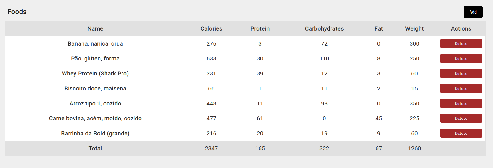

# Fitcal

### Description
Fitcal is a simple open source web application to simplify the calories tracking though the day. The point of the fitcal is to help me, so there will be features that may not make any sense for most people.

### How to install?
If you want to use that app, first you gotta clone the repository and install the dependencies of the project:
```bash
git clone http://github.com/tosuki/fitcal
cd fitcal
yarn
```
After you have installed the dependencies, you can run the app in development mode with `yarn dev`.

### Screenshots
- This is where you can stack the information of the eaten foods, so you can check how many protein, calories, carbohydrates or fat you have already eaten.

- In the future i hope i can improve the design of this and add the support to micro nutrients




### How to add more foods?
If you have cloned this repo and tried to use the website, you may have noticed that there aren't many foods registered in the app. This is because i'm lazy :D. However, feel free to add more foods information to the `src/app/lib/data/placeholder.ts`. The base numbers are based on 1g portion of the food. So if a food has `120` calories per `100g`, you have to put in the calories property `1.2`.

